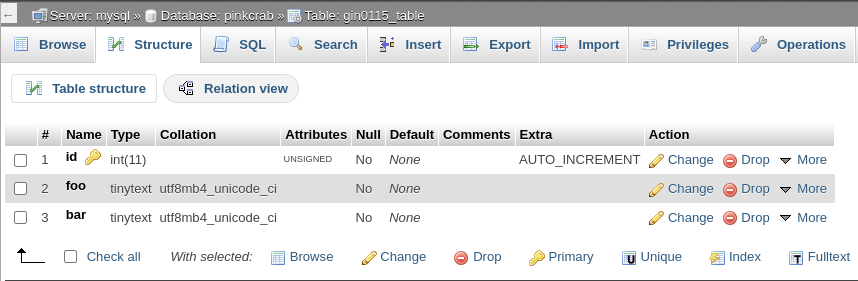
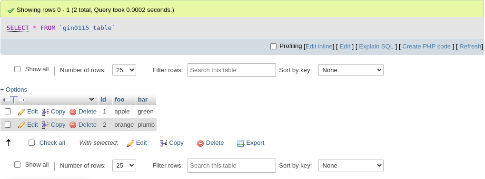

# Gin0115 Example Plugin

This is an example plugin to showcase the Perique Migrations service.

## Activating this plugin will create a custom table defined in the `src/Migration/Gin0115_Migration` class




## Once it has been uninstalled(deleted), the table and its seeded data will be dropped.

## Migration Model

The model used to define the tables schema, actions carried out on certain [Plugin Lifecycle Events](https://github.com/Pink-Crab/Perique_Plugin_Life_Cycle) and seed with initial data.

> As with Perique in general, these models are constructed via [`Periques DI Container`](https://perique.info/core/DI/). This allow injected services and access to the [`App_Config`](https://perique.info/core/App/app_config)

```php
class Gin0115_Migration extends PinkCrab\Perique\Migration\Migration {

    /** @var PinkCrab\Perique\Application\App_Config */
    protected $app_config;

    /** @var Gin0115\Perique_Migrations_Example\Service\Some_Service */
    protected $some_service;

    public function __construct( 
        PinkCrab\Perique\Application\App_Config $app_config, 
        Gin0115\Perique_Migrations_Example\Service\Some_Service $some_service 
    ) {
        $this->app_config   = $app_config;
        $this->some_service = $some_service;

        // The parents constructor should always be called after setting any dependencies.
        parent::__construct();
    }

    /**
     * Sets the table name, from App Config
     *
     * @return string
     */
    protected function table_name(): string {
        return $this->app_config->db_tables( 'gin0115' );
    }

    /**
     * Defines the schema for the migration.
     *
     * @param Schema $schema_config
     * @return void
     */
    public function schema( PinkCrab\Table_Builder\Schema $schema_config ): void {
        $schema_config->column( 'id' )
            ->unsigned_int( 11 )
            ->auto_increment();

        $schema_config->column( 'foo' )
            ->text( 24 );

        $schema_config->column( 'bar' )
            ->text( 24 );

        $schema_config->index( 'id' )
            ->primary();
    }

    /**
     * Seed table using data from some injected service.
     *
     * @param array<string,mixed>[] $seeds
     * @return array<string,mixed>[]
     */
    public function seed( array $seeds ): array {
        return $this->some_service->generate_migration_seeds();
    }

    /**
     * This table should NOT be dropped when its deactivated
     *
     * @return bool
     */
    public function drop_on_deactivation(): bool {
        return false;
    }

    /**
     * This table should be dropped when its uninstalled
     *
     * @return bool
     */
    public function drop_on_uninstall(): bool {
        return true;
    }
}
```

This is passed to the Migration services as its class name (this allows for construction via the DI, with out dependencies injected.)

```php
// Boot a barebones version of perique
$app = ( new PinkCrab\Perique\Application\App_Factory() )
	->with_wp_dice()
	->app_config(
		// Usually you do with as its own file with more settings!
		array(
			'db_tables' => array(
				'gin0115' => 'gin0115_table',
			),
		)
	)
	->boot();

// Setup Plugin Life Cycle and Migration services.
$plugin_state_controller = new PinkCrab\Plugin_Lifecycle\Plugin_State_Controller( $app );
$migrations              = new PinkCrab\Perique\Migration\Migrations( $plugin_state_controller, 'perique_migrations_example_a' );

// Add our migration
$migrations->add_migration( 'Gin0115\Perique_Migrations_Example\Migration\Gin0115_Migration' );

// Finalise.
$migrations->done();
$plugin_state_controller->finalise( __FILE__ );
```

## More Details
Please see the [Perique Migrations](https://github.com/Pink-Crab/Perique_Migrations) repo for more details documentation.
